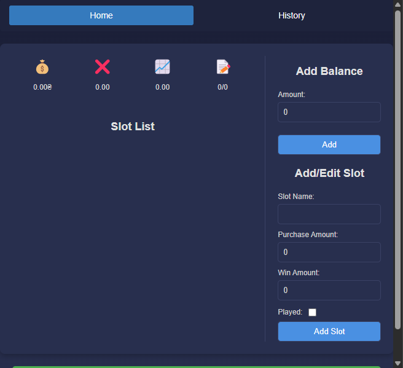

# Bonus Calculator Chrome Extension

This Chrome extension is designed to help you calculate bonuses when purchasing slots in online casinos.

## Description

The extension provides a user-friendly interface to:

* **Calculate Balance:** Add and track your current balance.
* **Calculate Average x:** Compute the average win multiplier (x) based on played slots.
* **Calculate Required Average x:** Determine the average multiplier needed to reach your desired balance.
* **Manage Slot List:** Add, edit, and delete records of your slot purchases.
* **Track History:** Save a history of your sessions to analyze results and monitor progress.

## Installation

1.  Download the repository from GitHub.
2.  Open Chrome and navigate to `chrome://extensions/`.
3.  Enable "Developer mode" in the top right corner.
4.  Click "Load unpacked" and select the extension's folder.

## Usage

1.  After installation, the extension icon will appear in the Chrome toolbar.
2.  Click the icon to open the extension's interface.
3.  Use the input fields to add your balance and slot information.
4.  View statistics and the slot list on the main page.
5.  Use the navigation buttons to switch to the history page.
6.  On the history page, view saved sessions and their details.

## Features

* **Main Page:**
    * Display current balance.
    * Calculate and display average x.
    * Calculate and display required average x.
    * Manage slot list (add, edit, delete).
    * Save history and clear data button.
* **History Page:**
    * Display saved sessions.
    * View details of each session (balance, slots, timestamp).
    * Navigate through history with pagination buttons.

## Data Storage

* Balance and slot list are stored in `chrome.storage.sync`.
* Session history is stored in `chrome.storage.local`.

## Dependencies

* Chrome browser

## Author

* Yaroslav Vovnenko (Qidsen)

## License

This project is licensed under the MIT License. See the [LICENSE](LICENSE) file for details.

## Screenshots

## Acknowledgments

* This extension was developed using the Chrome Extensions API.
* Special thanks to the open-source community for providing valuable resources and libraries.
